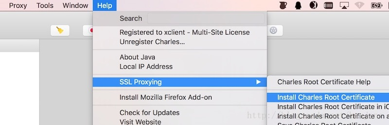
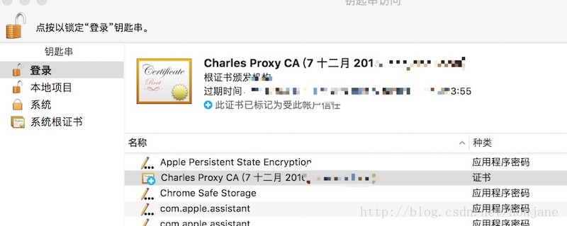
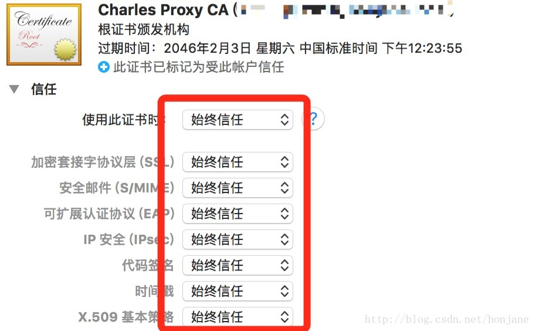
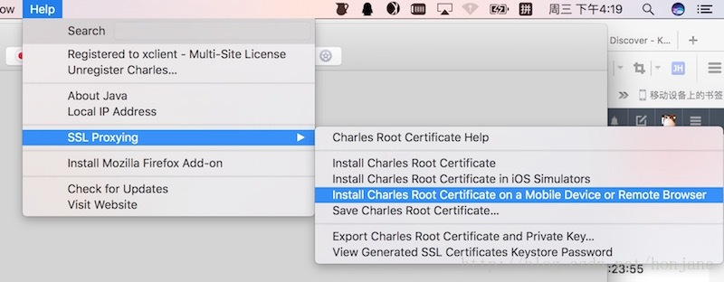
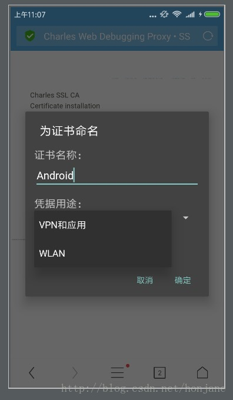
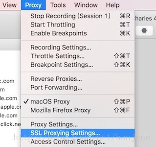

# Charles抓取Android下的https包

## 1、mac下安装根证书

> help–>SSLProxying–> Install Charles Root Ceriticate


> 跳转


> 找到Charles Proxy CA(xxx)——>打开——>选择信任——>始终信任


## 2、手机安装证书

> 安装手机证书 （注意： 安装证书过程需要手机wifi设置电脑IP地址代理 否则不会下载证书）help–>SSLProxying–> Install Charles Root Ceriticate on a Mobile Device or Remote Browser


> 然后在手机浏览器中访问手机 http://charlesproxy.com/getssl ，出现安装证书提示，随便打个名称 比如android，选择WLAN（这里Android，一定要选WLAN而不是VPNxxx），确定到这里手机端就设置好了，下面设置过滤条件


```
如果没有出现上面的弹窗，仅仅下载了证书，此时需要手动安装证书
1、下载证书时，重命名为: "charles.pem"，注意后缀一般必须是pem
2、打开手机的文件管理器，找到charles.pem，点击安装。如果安装成功，那么恭喜你，理论上，现在手机的https访问数据，已经能被charles获取。不过，如果你的手机出现了类似下图的说明，请继续执行下一步。
```

> 打开手机设置 -》更多设置 -》系统安全 -》从存储设备安装 -》选择charles.pem，点击安装。
> 小米手机对sdcard文件的存取，做了安全限制。如果你没有设置屏幕锁，或者没有开启屏幕锁，操作sdcard文件时会出现上面的提示（具体可参见http://www.miui.com/thread-3244178-1-1.html）。这时，你需要设置一下屏幕锁，再重新安装一下就行了。
要补充的是，在小米机器上，如果经过上述操作，.pem还是无法正常安装，请尝试把文件重命名为.crt，再重复上述操作